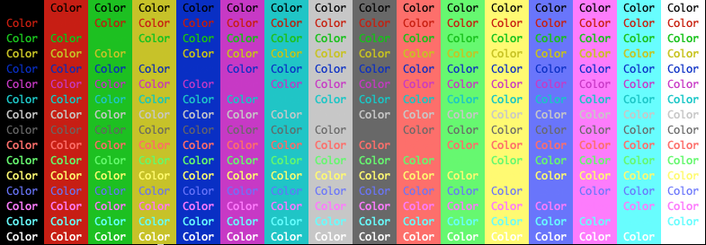
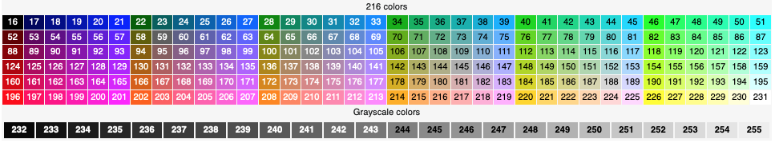

# ft_colors
## Ma petite librairie de mise en forme du texte affiche sur le terminal.

### Fonction principale: set_layout

`set_layout` demande trois arguments, le premier est la couleur du texte (fg), le deuxieme est la 
couleur du fond (bg):

Voici les couleures disponibles avec des macros:

Noir: - `C_BLACK` 
Rouge: - `C_RED` 
Vert:  - `C_GREEN` 
Jaune: - `C_YELLOW` 
Bleu: - `C_BLUE` 
Magenta: - `C_MAGENTA` 
Cyan - `C_CYAN` 
Blanc: - `C_WHITE` 

Voici toutes les combinaisons possibles avec ces couleurs: 

Toutes les couleures ont une version "high" qui augemente leur intensite en placant un H avant. 
Exemple: `C_HRED`

Si vous ne trouvez toujours pas votre bonheur, il y a 216 autres couleurs disponible. les voici: 

Le troisieme argument est le style, voici les macros que vous pouvez utiliser: 

Gras: - `C_BOLD` 
Transparant: - `C_FADED` 
Italic: - `C_ITALIC` 
Sousligne: - `C_UNDERLINE` 
Couleur inversee fg/bg: - `C_REVERSE` 
Caché: - `C_HIDE` 
Barré: - `C_CROSSED` 
Clignote: - `C_BLINK` 
Arrete de clignoter: - `C_BLINKOFF` 

Voici les retours, le blink fonctionne pas sur toutes les machines, et evidemment je ne peux pas le screen 

### Details importants

Pensez a reset les arguments entres chques utilisation pour ne pas avoir de problemes grace a `C_RESET`  
Vous pouvez tout reset avec un `set_layout(C_RESET, C_RESET, C_RESET);` 
Ou alors vous pouvez reset seulement un argument `set_layout(C_YELLOW, C_HWHITE, C_RESET);` 

`set_layout` fonctionne avec write  
`set_layout_printf` fonctionne avec printf et est disponible avec la regle de makefile printf, elle fonctionne exactement de la meme maniere que `set_layout` 

## Autres fonctions

### delete_std

`delete_std` supprime n characteres qui ont ete precedement ecris sur la sortie standard 
`delete_std_printf` fonctionne avec printf et est disponible avec la regle de makefile printf, elle fonctionne exactement de la meme maniere que `delete_std` 

### loading_bar

`loading_bar` affiche une barre de progression avec n pourcent de progression, je vous conseille de l'ultiliser comme ceci: `loading_bar(courent / total)`

## Comment utiliser la librairie?

Cette librairie est faite pour etre utilisee sur tous les projets de 42 ou `write` est autorisee, mais quand on debug on fait pas des ft_putstr, on fait des printf, or certaines fonctions ne sont pas compatibles avec printf, c'est pourquoi je les ai "dupliquées" afin de pouvoir les utiliser en toutes circonstances. 
Donc si votre projet n'accepte pas la vraie `printf`, vous pouvez seulement faire `make` pour n'avoir que des fonctions avec `write`, faire `make printf` ajoutera le reste des fonctions. 
Cependant pour l'instant la liste des fonctions `write` est si petite qu'elle tient en un seul fichier: `set_layout.c`, donc vous pouvez prendre seulement ce fichier pour faire vos tests. Attention a importer les macros avec!

Voici la liste des fonctions:

Compatibles avec `write`, utiliser `make`:
- `set_layout`
- `delete_std`

Compatibles avec `printf`, utiliser `make printf`:
- `set_layout_printf`
- `delete_std_printf`
- `loading_bar`

Cette librairie risque fortement de s'aggrandir! 
Si quelque chose bug, que vous avez des questions ou des suggestions vous pouvez m'envoyer un message sur: 
Discord: Jenos#6266 
L'intra: nguiard 
